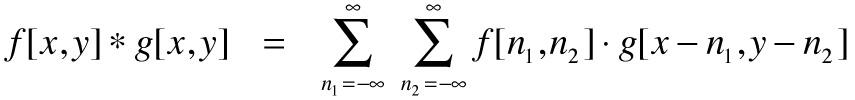
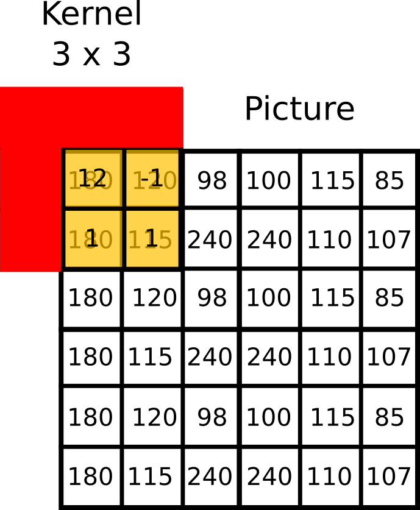
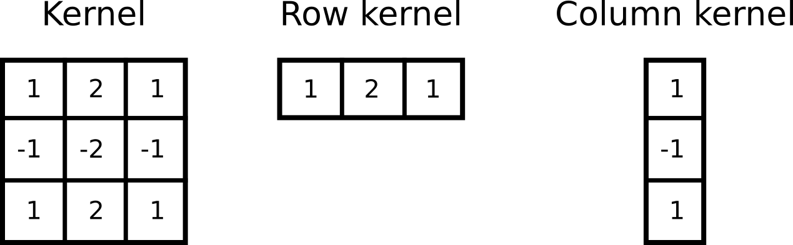
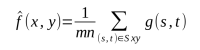
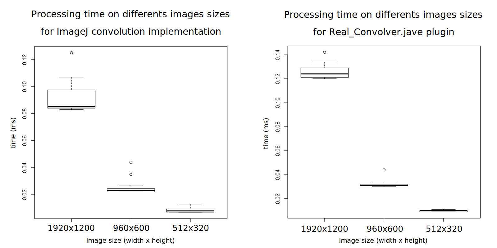
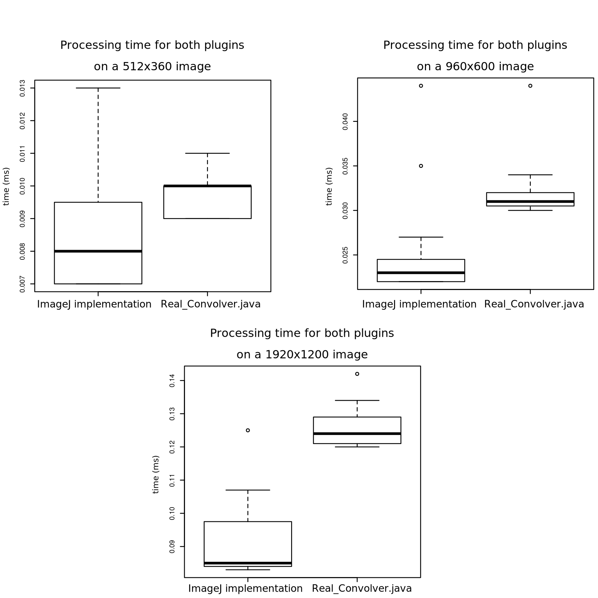
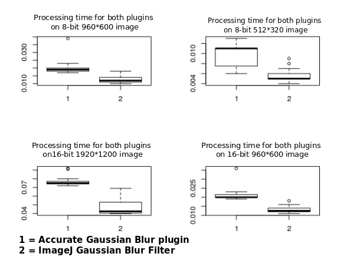
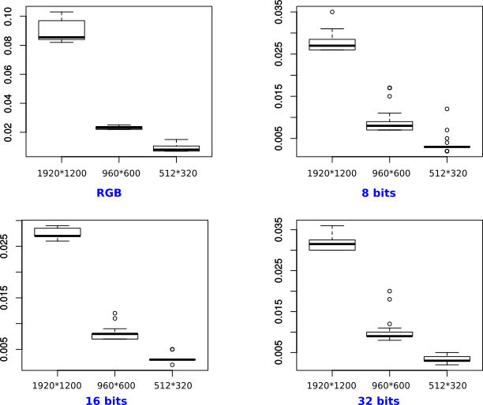

# <center>2D filters methods for image processing</center>
<span style = "color:grey">**Formation**</span> Master 2 Bioinformatic<br/>
<span style = "color:grey;float:right">**Course 4TBI901U**</span> Structural Bioinformatic<br/>
<span style = "color:grey">**Authors**</span>
Gary BOUCHENTOUF <b>*</b>
Tristan FRANCES
Thomas MAUCOURT<br/>
<span style = "color:grey;float:right">**Referent**</span>
Jean-Christophe TAVEAU

## Introduction
<span style = "text-align:justify">

The development of technologies allowing images captures has permited scientists to use new devices in many domains such as astronomy, geology, biology, etc... The main problem to deal with images is their processing since a raw format image is rarely sufficient to make analysis. Actually there are additional steps required which are called image processing. After treatment the images are ready for analysis and interpretations.
There are many possibilities to process an image according to the final result wanted. In this report we will focus on 2D Linear Filters. Filters are used to convert an input image into an output, based on the convolution product principle (Figure 1).

<center></center>
<span style = "font-size:10px"> <b>Figure 1</b>. Basic convolution product formula. This mathematical formula can be seen as the combination of two matrix in image processing.</span>
<br/><br/>

Basically, a convolution product is the result of two matrix combinations. Convolution operation needs an image and a convolution mask also called kernel. An image is actually a bidimensional matrix in which, each square corresponds to a specific pixel value. Its dimension has a value of *width x height*. This matrix will be combined with the convolution mask which is a matrix *j x k* with *j* and *k* odds values. It is important to keep in mind that if the kernel is not symetrical, it needs a rotation of 180 degrees.
The result of the convolution product gives a new value to the central pixel of the kernel. This value is based on the weighted average of the surrounding pixels. It leads to a new image with modified pixels values.

Through this report we will discuss three filters using this mathematical principle in ImageJ<sup>[1]</sup> software. The first operation studied will be the convolution, then the Gaussian blur and finally the mean filter.

## 1. Material and Methods

### 1.1. ImageJ
To perform the experiments explained later in this report ImageJ<sup>[1]</sup> software has been used. It is an open source software regrouping a large community and allowing images manipulations and analyses. It is widely used across the world by many researchers in all kinds of domains. One thing that make the popularity of ImageJ is the possibility to easily develop plugins to automatize image processing and analyses. The other advantage is its well documented API (Application Programming Interface). Thus we decided to use this software because the main goal of the project is to develop an adaptation of ImageJ for web browsers.

### 1.2. Convolve
We previously define that convolution needed an image and a kernel to be performed. That raises a problem of coverage between the mask and the targeted sample of the picture. Indeed at the borders of the image the kernel can have some of its parts outside the picture (Figure 2). To solve this issue several possibilities can be applied :
* adding a stripe of pixels with a value equals to 0 (black) around the image
* extending the borders by mirroring the edges
* starting the processing at position *(X<sub>kw-1/2</sub>, Y<sub>kh-1/2</sub>)* with *kw* and *kh* respectively the kernel's width and height

<center></center>
<span style = "font-size:10px"> <b>Figure 2</b>. Boundary issue for a 3 x 3 kernel. On the edges of the picture some parts of the kernel can be located outside the image.</span>
<br/><br/>

As convolution is a well defined mathematical principle very used in many domains and especially in image processing, several methods have been developed to improve the computation. We can find four main implementations of convolution :
* basic approach
* convolution with separable kernels
* recursive filtering
* fast convolution

First the "basic approach". It is simply based on the definition of convolution. It computes the inner product of the current sample of the image and the kernel. The value obtained is then stored into the central mask's pixel. For information, the algorithmic complexity of such method is *O(N²)*. This approach is still widely used due to its simplicity and the possibility to parallelize the processing<sup>[2]</sup>.

An other way to perform convolution is allowed in the case of specific kernels called separable <sup>[3]</sup>. A kernel is separable in 2-Dimensions when it can be decomposed into two vectors (a column vector and a row vector) (Figure 2). These kinds of kernels are found in Gaussian masks for example. Such kernels decrease the complexity because they allow to separate the basic convolution process into two simpler convolutions. First the columns are treated by convolution with the column kernel. Then the process is repeated with the row kernel.

<center></center>
<span style = "font-size:10px"> <b>Figure 3</b>. Specific separable kernel. The original kernel (left) can be splitted into two 1-Dimension kernels. A row kernel and a column kernel. Each kernel will be applied to the picture separatly.</span>
<br/><br/>

The third method available to apply convolution is called recursive filtering<sup>4</sup>. This approach is based on the dependence of a sample (rank *n*) with the previous one (rank *n-1*, *n-2*, ...). It needs a step to define the recursive formula needed for the convolution product wanted. This can be very hard task. Thus it is not a very used method among the others one.

The last approach we will discuss is the most popular and is actually the one implemented into ImageJ software. The fast convolution<sup>5</sup> is based on the frequency domain<sup>6</sup> unlike the previous we discussed that were used into the spatial (or time) domain. This method go through an extra step by using the Fast Fourier Transform (FFT)<sup>6</sup> on the input signal before performing convolution. According to a mathematical principle a convolution into the frequency domain is equivalent to a product of Fourier Transforms. This means that a convolution into the spatial domain is equivalent to a multiplication into the frequency domain. Thus :
<center><b><i>kernel * sample = FFT<sup>-1</sup>(FFT(kernel) x FFT(sample))</i></b></center>
('*' stands for convolution and 'x' for multiplication)

By looking for plugins implementing the different methods described above, we have been able to locate just one plugin different from the one used by default in ImageJ. This plugin is called <b>```Real_Convolver.java```</b> (credit to Wayne Rasband) and implements the simple convolution into the spatial domain. It allows the use of convolution only for 32 bits images, so the totality of the benchmarking has been realized on this type of image.

### 1.3. Gaussian Blur

The Gaussian Blur also known as Gaussian Smoothing operator is a convolution operator used to blur<sup>[7]</sup> images and remove details and noise (Figure 4). In this sense it is similar to the mean filter, but differs by using a different kernel.

<center> </img></center>
<span style = "font-size:10px"><b>Figure 4.</b> Result of Gaussian blur filtering. (A) Original picture. (B) Filtered image. </span>
<br/><br/>

Differently sized kernels containing different patterns of numbers give rise to different results under convolution. For instance, Figure 5 shows a 5x5 kernel that implements a Gaussian Blur filter.

<center> </img></center>
<span style = "font-size:10px"><b>Figure 5.</b> Example of a Gaussian kernel.</span>
<br/><br/>

The Gaussian kernel is named after Carl Friedrich Gauß (1777-1855), a German mathematician. They belong to separable kernels described above and are composed of Gaussian values obtained from the Gauss distribution (Figure 6). Using such kernel allows a strong decrease of the algorithmic complexity and thus a quicker processing<sup>[8]</sup>. Gaussian Blur filtering consists in realising a convolution on a picture with a Gaussian kernel.

<center> </img></center>
<span style = "font-size:10px">
<b>Figure 6.</b> Representation of the Gaussian distribution and equation.</span>
<br/><br/>

In the equation, *x* is the distance from the origin for the absciss, *y* is the distance from the origin for the ordinate, and σ is the standard deviation of the Gaussian distribution. Again, to speed up image processing, algorithm have been developed. Here we will compare the ImageJ default ```Gaussian Blur``` filter to a JAVA  plugin, ```Accurate Gaussian Blur``` (credit to Michael Schmid). This last has been implemented for high accuracy treatement especially for 32-bits images. Also, these methods encounter the same trouble as the convolution in term of image edges.

### 1.4. Mean filter

Among the linear filters, the most common is the mean filter because it is easy to implement and reliable. As said before (see section *1.3 Gaussian blur*), it is a smoothing filter aiming to smooth an image by blurring and removing details and noise. As follows, a convolution mask is used, it can be differently shaped (square, rectangular or circular) and in vast majority the weights in the kernel are uniforms (meaning the values in the kernel are the same), but those can also be triangular (i.e. inversely proportionnal to distance from the input sample)<sup>[9]</sup>.

For example if S<sub>xy</sub> represents the set of coordinates in a rectangular sub image window of size *m × n* centered at point *(x,y)*, the arithmetic mean filtering process computes the average value of the initial image *g(x,y)* in the area defined by S<sub>xy</sub>. The value of the final image *f* at any point *(x,y)* is simply the arithmetic mean computed using the pixels in the region defined by S<sub>xy</sub>. In other words :

<center> </img></center>

This operation can be implemented using a convolution mask in which all coefficients have a value of *1/(kw x kh)* with *kw* and *kh* respectively the kernel's width and height. A mean filter simply smoothes local variations in an image. Noise is reduced as a result of blurring. The main problem of this filter is that noisy pixels (including anomalous spikes) are weighted the same as all the other pixels in the kernel. <sup>[10]</sup>
Because it uses a convolution kernel, we find the same issue as describe in section *1.2 Convolve*, thus the same solutions can be applied here for the edges of the picture.

During our research, we did not find any plugins performing mean filter in a different way than the one implemented in ImageJ software. That is why the benchmarking were realised only with the mean filter already implemented in ImageJ.

### 1.5. Benchmark

Benchmarks were realized based on time of processing on the same computer. A JavaScript script was implemented to automatize the process. First a warmup phase consisting in running 200 times the chosen operation is performed. After that the script switch to the testing phase consisting in 200 runs of the  selected. This process is used on the same RGB image with a size of *1920\*1200*. This image was converted into 32 bits, 16 bits and 8 bits greyscale images and the benchmark was performed on each of these pictures for each filter when it was possible. To get more data on other sizes of image, the initial picture was also resized two times. This leads to three images sizes : *1920\*1200*, *960\*600* and *512\*320*. The results are displayed in the ImageJ log console and saved into a csv file.
In this case, time processing of Convolve, Mean and Gaussian blur were calculated. A R script allows to get a boxplot of the results showing the different quartils and the mean of data for the testing phase.  The process has been repeated for the alternatives plugins found for the different filters.

Benchmarking in JavaScript is really complicated since the results are very variable and that they depend a lot on the state of the computer used for the test. Moreover, implementing a good benchmark implies a deep understanding of the execution processes and the interpreter. Thus the results obtained by our method have to be taken with care and as informative.

## 2. Results

### 2.1. Convolve
We compared two plugins, one realizing the "original" way to make a convolution and another one getting an extra step of FFT to get the result.
The first thing important to note is that the output images from one method and the other are the same (Figure 7).

<center></center>
<span style = "font-size:10px"> <b>Figure 7.</b> Convolution performed with ```Real_Convolver.java``` (on the left) and the ImageJ default convolution filter (on the right)</span>
<br/><br/>

First, the time of processing for the different images size were computed using R (Figure 8). This shows a diminution of processing time the smaller the image gets.

<center></center>
<span style = "font-size:10px"> <b>Figure 8</b>. Comparison of convolution processing time for 3 types of images. The reduction of pixels leads to a decrease in time processing for the ImageJ implementation of convolution and for the plugin ```Real_Convolver.java```.</span>
<br/><br/>

In a second time, a comparison between <b>```Real_Convolver.java```</b> and the convolution plugin implemented into ImageJ was performed (Figure 9). We can see that the plugin using the step of FFT, the ImageJ's one, takes less time to process an image no matter the considered size.

<center></center>
<span style = "font-size:10px"> <b>Figure 9</b>. Processing time for different images sizes and comparison between the ImageJ convolution and the `Real_Convolver.java`. From left to right we can see the diminution of time processing for both plugins but with a better performance for the FFT extra step processing.</span>

### 2.2. Gaussian Blur

In regards to Gaussian blur, after running the two plugins on a same image, we have compared their execution time and results are introduced in figure 10. Here, just four plots are represented but the tendency in the twelves graphs generated were the same.

<center> </img></center>
<span style = "font-size:10px"><b>Figure 10.</b> Representation of time processing for ImageJ Gaussian blur and accurate gaussian blur plugin.</span>
<br/><br/>

The general tendency for each boxplot if we compare both processes is the same. The accurate plugin has an execution time always longer than the imageJ default filter.

If we take a look at the values on ordinate, we notice a time diminution when we apply the filter and plugin on smaller images. This fact is also true for the image type, but the image size seems to have more influence on running time.

### 2.3. Mean filter

The results of this benchmark are represented in Figure 11.

<center> </img></center>
<span style = "font-size:10px"><b>Figure 11.</b> Representation of the benchmark for the mean filter of ImageJ </span>
<br/><br/>

We obtain 4 graphics (one per type of image) which contains 3 boxplots (one per size of image) comparing the differences of time processing. We notice no real differences of time processing regarding image types. However it is not the case for the size that shows the bigger the image is, the longer the processing last.

## 3. Discussion
The several benchmarks performed allowed us to observe certain behaviors for the different plugins tested.

For the convolution part, we have seen that the algorithm using an FFT before the convolution (ImageJ) seems to have better performances than the `Real_Convolver.java`. As expected, we saw a decrease of processing time the less the image is big and this has been seen for all the filters. That can easily be explained by the fact that it needs less computing for tiny image because there are less pixels to process.

According to our results, we can say that there is a processing time difference between the Gaussian Blur filter and the Accurate Gaussian blur filter which can be explain by the fact that this last has high accuracy taking more time when computing. We can also say that images types have an influence on process duration, this one beeing longer with RGB pictures than 8-bits images. We can explain time processing differences between RGB and grayscale images by the values contained into the pixels. Actually in RGB pictures, we have three channels whereas grayscale pictures just have one. Then the less bits are used to compose an image the less memory it takes and so the less time processing lasts.

Concerning the mean filter, the results of the benchmark do not allow us to conclude because of the lack of alternative plugins and the weak sturdiness of the benchmarking using JavaScript. This can be explained by the fact that the mean filter is not a good noise remover, due to its simple algorithm. Several other methods, like Gaussian blur filter or median filter (not linear), have been developed to produce more efficients filters for noise removal.

## Conclusion
Through this work, we were able to study the different process used for 2D filtering. The final goal is to implement the best algorithm into a "web ImageJ like" for each filter studied.

For a first approach we will implement the basic approach of convolution. For the further steps, we would like to use the convolution algorithm found in ImageJ source code. This will depends on the work of the team working on FFT. We will also implement the recognition of separable kernels to increase a bit more the processing by creating two vectors that will be used to make the convolution in two steps.

We strongly consider to implement a `Convolve` Class which has the purpose to make easier the implementation of the Gaussian Blur and mean filter implementations. Thus, those would be implemented by simply calling this class and specifying the paramaters adapted in agreement with the operation to apply.

## References
1. Rasband, W.S., ImageJ, U. S. National Institutes of Health, Bethesda, Maryland, USA, https://imagej.nih.gov/ij/, 1997-2016.

2. S. Kadam. Parallelization of Low-Level Computer Vision Algorithms on Clusters. In AMS ’08: Proceedings of the 2008 Second Asia International Conference on Modelling & Simulation (AMS), pages 113–118, Washington, DC, USA, 2008. IEEE Computer Society. ISBN: 978-0-7695-3136-6.

3. Robert Hummel and David Loew. Computing Large-Kernel Convolutions of Images. Technical report, New York University, Courant Institute of Mathematical Sciences, 1986.

4. B. Jähne. Digital Image Processing. Springer, 5th edition, 2002.

5. Jan J, Engineers I of E. Digital Signal Filtering, Analysis and Restoration. IET; 2000. 430 p.

6. R. N. Bracewell. Fourier Analysis and Imaging. Springer, 2006

7. Kabbai, Leila & Sghaier, Anissa & Douik, Ali & Machhout, Mohsen. (2016). FPGA implementation of filtered image using 2D Gaussian filter. International Journal of Advanced Computer Science and Applications. 7. . 10.14569/IJACSA.2016.070771.

8. Waltz FM, Miller JWV. An efficient algorithm for Gaussian blur using finite-state machines. Atmospheric Effects on Electro-Optical, Infrared, and Millimeter Wave Systems Performance, Contemporary Methods of Optical Fabrication, D Mach Percept, Developments in Civil Engineering, INT CONF ON FOURIER TRANSFORM INFRARED SPECTROSC, INT SYMP OF BIOMECH CINEMATOGR AND HIGH SPEED PHOTOGR, 2ND, PROC SPIE INT SOC OPT ENG, Proceedings of SPIE- The International Society for Optical Engineering, Proceedings of SPIE-The International Society for Optical Engineering, SHUTTLE OPT ENVIRON, Wavefront Distortions in Power Opt. 1998;3521:334‑41.

9. MATT HALL. Smooth operator: Smoothing seismic interpretations and attributes. The Leading Edge. 2007 Jan;26(1):16–20.

10. Gajanand Gupta. Algorithm for Image Processing Using Improved Median Filter and Comparison of Mean, Median and Improved Median Filter. International Journal of Soft Computing and Engineering (IJSCE) ISSN. 2011 Nov;Volume-1(Issue-5):2231–307.

</span>
