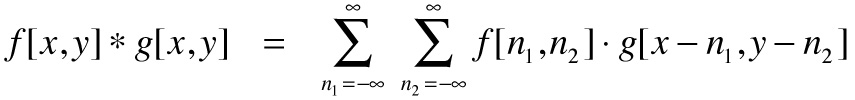
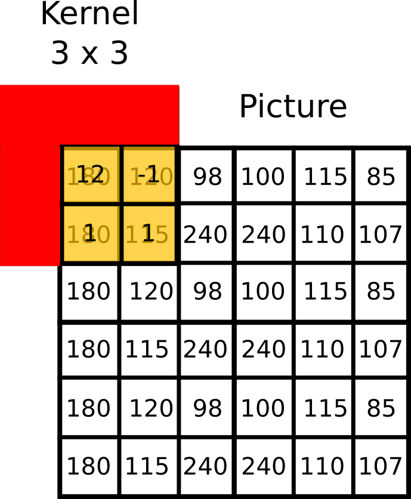
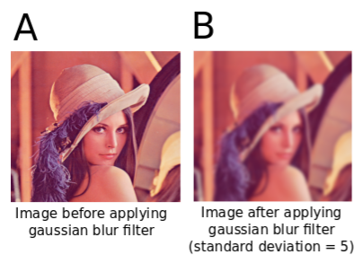
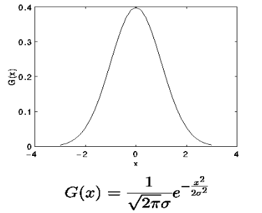
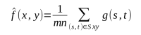
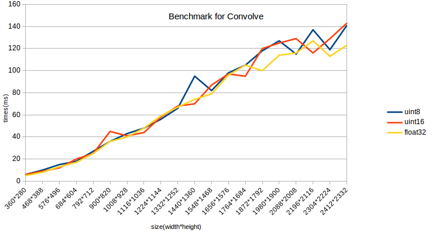
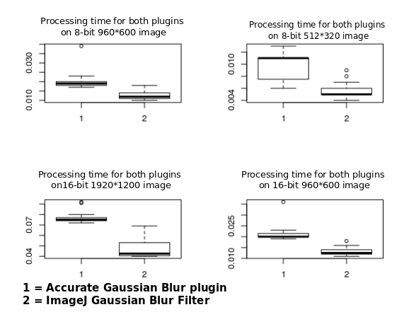
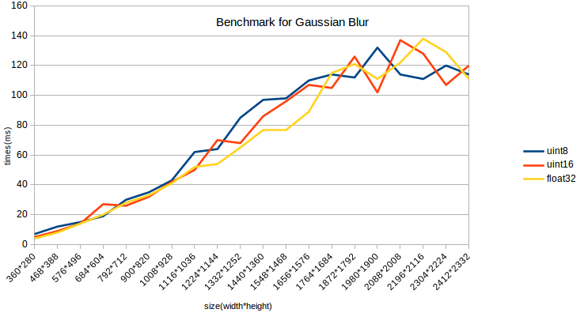
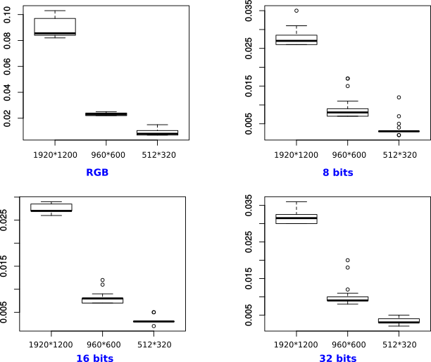
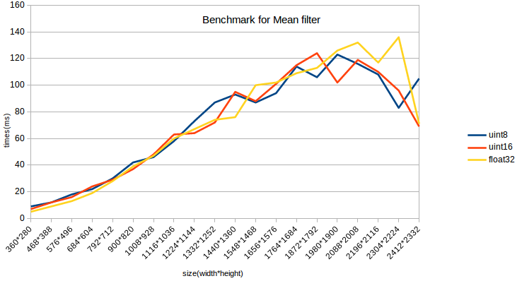

# <center>2D filters methods for image processing</center>
<span style = "color:grey">**Formation**</span> Master 2 Bioinformatic

<span style = "color:grey">**Course 4TBI901U**</span> Structural Bioinformatic

<span style = "color:grey">**Authors**</span>
Gary BOUCHENTOUF <b>*</b>
Tristan FRANCES
Thomas MAUCOURT

<span style = "color:grey">**Referent**</span>
Jean-Christophe TAVEAU

## Introduction
<span style = "text-align:justify">
The development of technologies allowing images captures has permited scientists to use new devices in many domains such as astronomy, geology, biology, etc... The main problem to deal with images is that raw formats are rarely sufficient to make analysis. Actually there are additional steps required which are called image processing. After treatment the images are ready for analysis and interpretations.
There are many possibilities to process an image according to the final result wanted. In this report we will focus on 2D Linear Filters. Filters are used to convert an input image into an output, based on the convolution product principle (Figure 1).

<center></center>

**Figure 1**. Basic convolution product formula. This mathematical formula can be seen as the combination of two matrix in image processing.

Basically, a convolution product is the result of two matrix combinations. Convolution operation needs an image and a convolution mask also called kernel. An image is actually a bidimensional matrix in which, each square corresponds to a specific pixel value. Its dimension has a value of *width x height*. This matrix will be combined with the convolution mask which is a matrix *j x k* with *j* and *k* odds values. It is important to keep in mind that if the kernel is not symetrical, it needs a rotation of 180 degrees.
The result of the convolution product gives a new value to the central pixel of the kernel. This value is based on the weighted average of the surrounding pixels. It leads to a new image with modified pixels values.

Through this report we will discuss three filters using this mathematical principle in ImageJ<sup>[1]</sup> software. The first operation studied will be the convolution, then the Gaussian blur and finally the mean filter. We propose an implementation of each of those filters in ECMAScript6.

## 1. Material and Methods

### 1.1. Convolve
We previously define that convolution needed an image and a kernel to be performed. That raises a problem of coverage between the mask and the targeted sample of the picture. Indeed at the borders of the image the kernel can have some of its parts outside the picture (Figure 2). To solve this issue several possibilities can be applied :
* adding a stripe of pixels with a value equals to 0 (black) around the image
* extending the borders by mirroring the edges
* starting the processing at position *(X<sub>kw-1/2</sub>, Y<sub>kh-1/2</sub>)* with *kw* and *kh* respectively the kernel's width and height

<center></center>

**Figure 2** : Boundary issue for a 3 x 3 kernel. On the edges of the picture some parts of the kernel can be located outside the image.

As convolution is a well defined mathematical principle very used in many domains and especially in image processing, several methods have been developed to improve the computation. We can find four main implementations of convolution :
* basic approach
* convolution with separable kernels
* recursive filtering
* fast convolution

In the previous report we decided to target the basic approach of convolution. We also made the choice to start the image processing at *(X<sub>kw-1/2</sub>, Y<sub>kh-1/2</sub>)* with *kw* and *kh* respectively the kernel's width and height.

The "basic approach" is simply based on the definition of convolution. It computes the inner product of the current sample of the image and the kernel. The value obtained is then stored into the central mask's pixel.

We implemented an algorithm relying on this method (Figure X). This algorithm parse go through the image pixels and in the same time through the kernel values. It then compute the convolution and change the pixel value targeted.

```
FUNCTION convolve(kernel)(image, copy = true):
    result = TRaster.from(image_raster)
    # going through the image pixels
    FOR y FROM (kernel_height / 2) TO (image_height - kernel_height / 2):
        FOR x FROM (kernel_width / 2) TO (image_width - kernel_width / 2):
        i = 0
        sum = 0
        # going through the kernel
        FOR v FROM (-kernel_height / 2) TO (kernel_heigth / 2):
            # jumping to next pixel line of the image
            offset = x + (y + v) * image_width
            FOR u FROM (-kernel_width / 2) TO (kernel_width / 2):
                # adding computed value to a variable sum
                sum += image_pixels[offset + u] * kernel_values[i]
                i++
        # compute the new pixel value after convolution
        new_value = sum * scale
        IF new_value < 0:
            new_value = 0
        result.pixelData[x + y * image_width] = new_value
    RETURN result
```

**Figure 3** : Pseudocode describing the algorithm used to compute the convolution. The algorithm used is based on the basic approach and starts the processing using the crop method based on the kernel size.

It is important to notice that we followed the example of ImageJ software. Meaning that the kernel must be passed as a string to the convolve function. Then the string will be processed to create a kernel object containing informations about the size, width, height and the kernel himself as a 1D array. Then the convolution occurs. It just processes each part of the image and compute the convolution product. Finally the value computed is stored inside a raster that is returned at the end and used to apply changes to the image. An optionnal function was implemented in order to allow the user to normalize its kernel as it is available in ImageJ software.

### 1.2. Gaussian Blur

The Gaussian Blur also known as Gaussian Smoothing operator is a convolution operator used to blur<sup>[2]</sup> images and remove details and noise (Figure 4). In this sense it is similar to the mean filter, but differs by using a different kernel.

<center> </img></center>
<center><span style = "font-size:10px"><b>Figure 4.</b> Result of Gaussian blur filtering. (A) Original picture. (B) Filtered image. </span>
<br/><br/></center>

Differently sized kernels containing different patterns of numbers give rise to different results under convolution. For instance, Figure 5 shows a 5x5 kernel that implements a Gaussian Blur filter.

<center> </img></center>
<center><span style = "font-size:10px"><b>Figure 5.</b> Example of a Gaussian kernel.</span>
<br/><br/></center>

The Gaussian kernel is named after Carl Friedrich Gauß (1777-1855), a German mathematician. They belong to separable kernels described above and are composed of Gaussian values obtained from the Gauss distribution (Figure 6). Using such kernel allows a strong decrease of the algorithmic complexity and thus a quicker processing<sup>[3]</sup>. Gaussian Blur filtering consists in realising a convolution on a picture with a Gaussian kernel.

<center> </img></center>
<center><span style = "font-size:10px">
<b>Figure 6.</b> Representation of the Gaussian distribution and equation.</span>
<br/><br/></center>

In the equation, *x* is the distance from the origin for the absciss, *y* is the distance from the origin for the ordinate, and σ is the standard deviation of the Gaussian distribution. Again, to speed up image processing, algorithm have been developed. Here we will compare the ImageJ default ```Gaussian Blur``` filter to a JAVA  plugin, ```Accurate Gaussian Blur``` (credit to Michael Schmid). This last has been implemented for high accuracy treatement especially for 32-bits images. Also, these methods encounter the same trouble as the convolution in term of image edges.

```
const gaussBlur = (kernelSize, sigma) => (image, copy = true) => convolve(new Array(kernelSize * kernelSize).fill(0).map((x, i) => Math.exp(-(i - kernelSize / 2) * (i - kernelSize / 2 / 2.0 * Math.pow(sigma, 2.0)) / Math.sqrt(2.0 * Math.pow(sigma, 2.0) * Math.PI))).reduce((acc, x, i) => acc += i % kernelSize === 0 ? "\n" + x + " " : x + " ", ""))(image, copy);
```

**Figure 7** : Code describing the algorithm used to compute the gaussian blur filter by using functionnal programming. 

Before obtaining the final method 2 methods has been implemented,  <b>```gaussianBlur```</b> and <b>```gaussianTerms```</b>. Idea was to
 create a function returning a kernel. Then, knowing gaussian blur filter being a kind of convolution,  you just have to use the <b>```convolve```</b> method by passing a kernel in argument. That is why our <b>```gaussianTerms```</b> method return a kernel. 

Concerning this method,  it just calcul the value  of each token of the kernel and just take the kernel size and sigma in arguments respecting the formula described in figure 6.

### 1.3. Mean filter

Among the linear filters, the most common is the mean filter because it is easy to implement and reliable. As said before (see section *1.2 Gaussian blur*), it is a smoothing filter aiming to smooth an image by blurring and removing details and noise. As follows, a convolution mask is used, it can be differently shaped (square, rectangular or circular) and in vast majority the weights in the kernel are uniforms (meaning the values in the kernel are the same), but those can also be triangular (i.e. inversely proportionnal to distance from the input sample)<sup>[4]</sup>.

For example if S<sub>xy</sub> represents the set of coordinates in a rectangular sub image window of size *m × n* centered at point *(x,y)*, the arithmetic mean filtering process computes the average value of the initial image *g(x,y)* in the area defined by S<sub>xy</sub>. The value of the final image *f* at any point *(x,y)* is simply the arithmetic mean computed using the pixels in the region defined by S<sub>xy</sub>. In other words :

<center> </img></center>

This operation can be implemented using a convolution mask in which all coefficients have a value of *1/(kw x kh)* with *kw* and *kh* respectively the kernel's width and height. A mean filter simply smoothes local variations in an image. Noise is reduced as a result of blurring. The main problem of this filter is that noisy pixels (including anomalous spikes) are weighted the same as all the other pixels in the kernel. <sup>[5]</sup>
Because it uses a convolution kernel, we find the same issue as describe in section *1.2 Convolve*, thus the same solutions can be applied here for the edges of the picture.

The mean filter is actually a convolution which uses a specific type of kernel (usually a square kernel where all the values are equal to 1), hence we decided to implement it in javascript as a function which take the size of the kernel (e.g. its width) in parameter. This value of size is then used to create a new Array with a size equals to the size kernel squared and fill with 0.0 values. The values of the array will be replaced by characters, with values equals to 1 or the return character in case the kernel changes of line. This operation is ensured by a map and a reduce functions, then this array will be used by the convolve function by spliting and processing as a kernel object (just like for the Gaussian Blur function), see Figure X.

```
FUNCTION meanFilter(sizeKernel)(image, copy=true)
return convolve(
  Create new Array size = sizeKernel*sizeKernel
  Fill Array with 0.0
  Browse Array and replace values by 1
  Transform each values into string
    IF index % array width ===0:
    value = "\n"+1+""
    ELSE : value = 1+" "
    )(image)
  )
END FUNCTION
```
**Figure X** : Pseudocode describing the algorithm used to compute the mean filter. This approach is based on the convolution function.

Hence the mean filter will return the output of the convolution process, on the image selected, for its specific kernel. This implementation uses the kernel size in order to create the corresponding mean kernel. This process occurs in the convolve function.

During our research, we did not find any plugins performing mean filter in a different way than the one implemented in ImageJ software. That is why the benchmarking were realised only with the mean filter already implemented in ImageJ.

involves that the size is the kernel will be used in order to create the kernel when the mean filter is instantiated.

### 1.4. Benchmark

Benchmarks for the ImageJ software were realized based on time of processing on the same computer. A JavaScript script was implemented to automatize the process. First a warmup phase consisting in running 200 times the chosen operation is performed. After that the script switch to the testing phase consisting in 200 runs of the  selected. This process is used on the same RGB image with a size of *1920\*1200*. This image was converted into 32 bits, 16 bits and 8 bits greyscale images and the benchmark was performed on each of these pictures for each filter when it was possible. To get more data on other sizes of image, the initial picture was also resized two times. This leads to three images sizes : *1920\*1200*, *960\*600* and *512\*320*. The results are displayed in the ImageJ log console and saved into a csv file.
In this case, time processing of Convolve, Mean and Gaussian blur were calculated. A R script allows to get a boxplot of the results showing the different quartils and the mean of data for the testing phase. The process has been repeated for the alternatives plugins found for the different filters.

Benchmarks for the Tiny Image ECMAScript Application were also realized based on time of processing, a JavaScript script was also implemented to automatize the process. We decided to run the benchmark 20 times for a given image and process, with a warmup phase (runs 10 times) and the benchmark (run 10 times). The benchmark correspond of the mean time,in millisecond, to process one operation for a given image. Different size of the image are tested (20 sizes different) with an initial size of *360*x*280*, and a proportionnal extansion of the width and height by adding 108 pixels, until the size reach *2160*x*1680*.
We repeat the benchmark for the three types of image (uint8, uint16 and float32) and the three operations implemented (convolve, meanand Gaussian Blur). The results will be stored as a csv file that can be download by click on the html page.
For the representation of the results obtained we used a diagram available in LibreOffice where the X axis represent the time processing (ms) and the Y axis the size of the image.

Benchmarking in JavaScript is really complicated since the results are very variable and that they depend a lot on the state of the computer used for the test. Moreover, implementing a good benchmark implies a deep understanding of the execution processes and the interpreter. Thus the results obtained by our method have to be taken with care and as informative. Moreover it is really difficult to make some comparisons with ImageJ results obtained from a previous study. Actually the performance have not been measured on the same program, one was performed in ImageJ and the other in the web browser.

## 2. Results

### 2.1. Convolve
In order to assess the convolution costs in term of time processing, we used the benchmark method described previously. We found no significant difference in terms of image type for the processing. However regarding image size, we found that the more pixels are present in the image the more times it takes to achieve convolution process. This seems logical since there are more calculation to perform in order to convolve the entire image. 

We then compared the results between ImageJ results obtained from a precedent study (data not shown) and those coming from this study (Figure X). We determined that the processing time is quite similar to ImageJ plugin `Real_Convolver` while using a web browser and JS (~140 ms for a 1920x1080 image vs 120 ms for the JS implementation). This could possibly be explained by the fact that current JavaScript engines have been extremely optimized since this technology is widely used on the web. This still looks surprising since Java is a compiled language while JS is not.

<center> </img></center>

**Figure X.** Benchmarking of the convolution function implemented in JS. The processing time increase with the image size as expected. The results are very similar to the one measured in our previous study.

### 2.2. Gaussian Blur

In regards to Gaussian blur, after running the two plugins on a same image, we have compared their execution time and results are introduced in figure 10. Here, just four plots are represented but the tendency in the twelves graphs generated were the same.

<center> </img></center>
<span style = "font-size:10px"><b>Figure 10.</b> Representation of time processing for ImageJ Gaussian blur and accurate gaussian blur plugin.</span>
<br/><br/>

The general tendency for each boxplot if we compare both processes is the same. The accurate plugin has an execution time always longer than the imageJ default filter.

If we take a look at the values on ordinate, we notice a time diminution when we apply the filter and plugin on smaller images. This fact is also true for the image type, but the image size seems to have more influence on running time.


<center> </img></center>
<span style = "font-size:10px"><b>Figure X.</b> Representation of the benchmark for the Gaussian Blur filter of TIMES </span>
<br/><br/>

### 2.3. Mean filter

The results of the benchmark on ImageJ are represented in Figure 11.

<center> </img></center>

**Figure X.** Benchmarking of the ImageJ mean filter. Four plots are presentsone for each type of image and inside them the boxplots represent one size of image each.

We obtained 4 plots (one per type of image) which contained 3 boxplots (one per size of image) comparing the differences of time processing. We noticed no real differences of time processing regarding image types. However it is not the case for the size that shows the bigger the image is, the longer the processing lasts.

As it has been said before, we perform benchmark on the mean Filter operation on different type and size of images. The kernel that was used for all these benchmark were a 3*3 kernel with values equal to 1.
The results we obtained are represented in the figure X. We can see an increase of time processing for an increasing image size. However no real differences can be made between image types in term of time processing.

<center> </img></center>

**Figure X.** Benchmarking of mean filter function implemented in JS. We can see an increase of time processing the more the image size raises. The difference between images in term of time processing is not quite appearent.

## 3. Discussion

During this study we implemented ImageJ functions which are convolution, mean filter and Gaussian blur filter. We followed the functionnal programing paradigm in order to reduce the amount of code and potentially increase its readability. 

After benchmarking, for each functions we saw that the differences of time processing are more imacted by image size than image type. We supposed that this was due to the strong optimization made around the JS engines. However we do not have any explanation for the lack of difference of time processing for the different image types.

We performed some comparisons with benchmark realized during the previous step of development. We did not see any real differences in terms of time processing between ImageJ and our own JS implementation using the `times` API. 

## Conclusion
Through this work, we were able to study the different process used for 2D filtering. The final goal was to implement these filters in JS using the `times` API. 

Since convolution is a process which can be parallelized, the next goal is to implement this process for GPU computing. We will then use the webGL technology and convert our different algorithms in order to use them with it.

Some extra testing is still needed in order to spot possible errors, but the tests we realized were all a sucess and the results were all corrects.

The implementation in webGL is now our main idea and we will focus on this to increase our time processing for the differents algorithms we used.

## References
1. Rasband, W.S., ImageJ, U. S. National Institutes of Health, Bethesda, Maryland, USA, https://imagej.nih.gov/ij/, 1997-2016.

2. Kabbai, Leila & Sghaier, Anissa & Douik, Ali & Machhout, Mohsen. (2016). FPGA implementation of filtered image using 2D Gaussian filter. International Journal of Advanced Computer Science and Applications. 7. . 10.14569/IJACSA.2016.070771.

3. Waltz FM, Miller JWV. An efficient algorithm for Gaussian blur using finite-state machines. Atmospheric Effects on Electro-Optical, Infrared, and Millimeter Wave Systems Performance, Contemporary Methods of Optical Fabrication, D Mach Percept, Developments in Civil Engineering, INT CONF ON FOURIER TRANSFORM INFRARED SPECTROSC, INT SYMP OF BIOMECH CINEMATOGR AND HIGH SPEED PHOTOGR, 2ND, PROC SPIE INT SOC OPT ENG, Proceedings of SPIE- The International Society for Optical Engineering, Proceedings of SPIE-The International Society for Optical Engineering, SHUTTLE OPT ENVIRON, Wavefront Distortions in Power Opt. 1998;3521:334‑41.

4. MATT HALL. Smooth operator: Smoothing seismic interpretations and attributes. The Leading Edge. 2007 Jan;26(1):16–20.

5. Gajanand Gupta. Algorithm for Image Processing Using Improved Median Filter and Comparison of Mean, Median and Improved Median Filter. International Journal of Soft Computing and Engineering (IJSCE) ISSN. 2011 Nov;Volume-1(Issue-5):2231–307.

</span>
